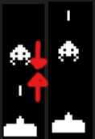

## Component #1: Code Design
### Refactoring:
Example taken from lecture slides
- 
1. [x] Tick movement if statement refactored to become a helper method
	- 
	- Becomes
	- 
2. [ ] Unreadable return statements being refactored
	1. 


### HELP Principles
#### High Cohesion:
Game Model has way too many responsibilities, as it manages:
1. The Game State
2. Handling Collisions
3. Spawning Objects
4. Tracking Achievements

To ensure game model has higher cohesion, we can split up these responsibilities into more focused / direct classes
1. CollisionManager
	1. Handles the collision of entities, 
2. SpawnManager
	1. Handles the spawning of objects 
3. LevelManager
	1. 
#### Encapsulation
The majority of methods have sufficient encapsulation that prevent methods being exposed for direct access however, there were two notable methods that needed to be fixed:
1. Direct access to spaceObjects was granted through getSpaceObjects, which exposed the internal list of spaceObjects.
	- To fix this, ..... **
#### Low Coupling

#### Polymorphism
Redundant code with large handle time can be refactored using polymorphism by splitting the behavior of the class to separate subclasses.


Optimisations:
1. Switching HandlePlayerInput to a switch for optimal runtime and code efficiency
	1. ![[Pasted image 20250519121624.png]]
	2. ![[Pasted image 20250519123049.png]]


-----
## Component 2: Limitations

List of bugs:
1. [x] Entity phasing on tick
	Classes to fix:
	1. GameModel
		1. CheckCollision <- Method to fix
	
	Entities to fix:
	- Bullet x Enemy
		1. Implement y || y+1
	- Bullet x Asteroid
		1. Implement y || y+1
	- Ship x Enemy
		1. Not implemented, as it would result in a worse bug
	- Ship x Asteroid
		1. Not implemented, as it would result in a worse bug
		
	Fix method:
	
	- When a bullet is fired, both it and the moving enemies are dependent on the current tick
		
	  But it is this very fact, that results in an issue when **both objects move in the same tick**. For example:
		
	  Given that the only result of this bug is the bullet being one position above the enemy, we can fix this by checking if a bullet is above the enemy at any time, and if so, flag this as the same collision
	  
	  This should work without fault, as there is no edge cases where the bullet would be above an enemy without it meaning to collide with it.
	
	Issues that arise when implementing:
	- Can a ship fire a bullet above the enemy?
		No, since the bullet spawning method makes a bullet above at the ship's x and y+1 position and thus spawning above the ship.
		Hence, for a bullet to spawn above the enemy, the ship must be in the same position as  the enemy which **SHOULD** cause a collision between ship and enemy before the bullet
		
	- Would this also trigger a collision with the entity above it (if any)?
		No, due to the fact that Entities are spawned in order, the collision checks for each entity would be considered / run from bottom up and thus the bullet would collide with the bottom entity only
	
	- Why not implement this for ship collisions?
		Since the ship's position is determined by the players input, its position can be directly above any entity and would incorrectly be deemed as colliding if this fix was implemented to this entity.
2. [x] Press enter to start
	Classes to fix:
	1. GameController (Handling the game flow / tick)
		1. HandlePlayerInput <- Method to fix
	
	Fix Method:
	- Implement a (working) catch case for the enter key that will then allow the game to start once pressed
		- Thus, create a hasStarted Boolean that will detemine if onTIck(tick) and handlePlayerInput(tick) will run
		- Implement a check for both of these functions to block the method's functionality
			- 
			- ![[Pasted image 20250519124234.png]]


	
	Fix method:
	- Create a Boolean for the game's start in GameController - hasStarted
	  When the game is initially run, check if a Boolean state is true, and if and ONLY if it is, then run the game, elsewise don't start the game
	
	Test method:
	Check if game starts immediately without enter key being used
3. [ ] No area handling for bountry exception
	Classes to fix:
	1. GameController
		1. HandleplayerMovement <- Method to fix

	Fix method:
	Instead of throwing a boundary exception catching an out-of-bounds move, handle the collision log the improper move.
4. [x] Two bullets hitting an object at the same time
	Classes to fix:
	1. GameModel
		1. CheckCollision <- Method to fix
	
	Entities to fix:
	- Bullet x Enemy
	- Bullet x Asteroid

	Fix method:
	- As stated in the javadocs, if multiple bullets collide with an entity, all bullets colliding must be destroyed
	- Once a collision is between bullet and entity is found, use the x and y positions of the bullet colliding to find if any other existing bullets have the same position, and hence destroy these bullets at the same time as the original bullet.
5. [ ] %% Time elapsed while game is paused %% -- Not required via javadocs
	Classes to fix:
	1. PlayerStatsManager
		1. Implement a Boolean that will allow the elapsed time to keep on ticking
6. [x] Ensure pausing the game has a toggled log 
	- i.e instead of logging "Game is paused!" on every pause press, it should alternate between 
		- "Game is paused!"
		- "Game is unpaused!"
	
	Fix:
	- Create a new method in gameModel, that returns a togglable state of isPaused
7. [x] Ensure pausing the game restricts the player's movement as the java docs state:
	- "When the game is paused, only un-pausing should be possible. No other action of printing should occur."
	Fix:
	- Use return statement to break out of the method if the game is paused, hence blocking all input aside from un-pausing the game.
	- 
	
	Fix:
	- Like the gameStarting block, create an if statement that blocks the functionality of the handlePlayerInput function if the game is paused
8. [x] Add the toString method implemented in a2 the ObjectsWithPosition
	1. 
9. [x] Remove the string output for powerups:
	1. HealthPowerUP
		
	2. ShieldPowerUp
		
10. [x] Implement descending movement for powerups
	fix:
	- Change the actions on tick to move downwards every 10 ticks
11. [x] For all tick-based movement, since the javadocs say 'every 10 ticks', it should not move on the initial tick so the operation used: 
	- "tick % 10 == 0" must be changed to
	- "tick % 10 == 0 && tick != 0" 
		For:
		`if (tick % 10 == 0 && tick != 0) {`  
		    `y++; // Move downward`  
		`}`
	This change is implemented to:
	1. Descending Enemies
	2. Powerups
12. [x] General limitations to GameModel:
	1. Implement 'statsTracker' input for gameModel 
	2. Implement Verbose variable, and getVerbose method
	3. Implement isGameOver method
	4. Add recordShotFired to fireBullet
	5. Add recordShotHit to collision
	6. Implement achievements on each tick
13. [x] General limitations to GameController
	1. Implement getModel
	2. Implement getStatsTracker
		1. Requires implementing gameModel.getStatsTracker.
	3. Implement RefreshAchievements
		1. Catch the edge case of going over-progress of achievements
	4. Implement fix of two bullets hitting an object at the same time
14. [x] GameModel.spawnobjects must not spawn when another object occupies space
	Fix:
	- Check if an object is in a space before spawning
	- Created a new method to return a Boolean if an object already is occupying the space
	- 
	- Implemented a check before each spawning action, ensuring no object is at that position
	- 
	- 
15. [x] Remove the logged output when firing a bullet
	- Fix: Remove the following line from gameModel.fireBullet()
		


------
## Component 3: JUnit Tests


------

## Component 4: Implementation

1. [x] Achievement package must be implemented
	1. Implement Achievement interface
		``` 
		public interface Achievement { ... }
		```
	2. Implement AchievementFile interface
	3. Implement AchievementManager class
	4. Implement GameAchievement class
	5. Implement FileHandler class
	6. Implement PlayerStats tracker
2. [x] Implement Assets folder
3. [x] Implement fix to check collistion
	1. Remove bullet when collide with asteroid
